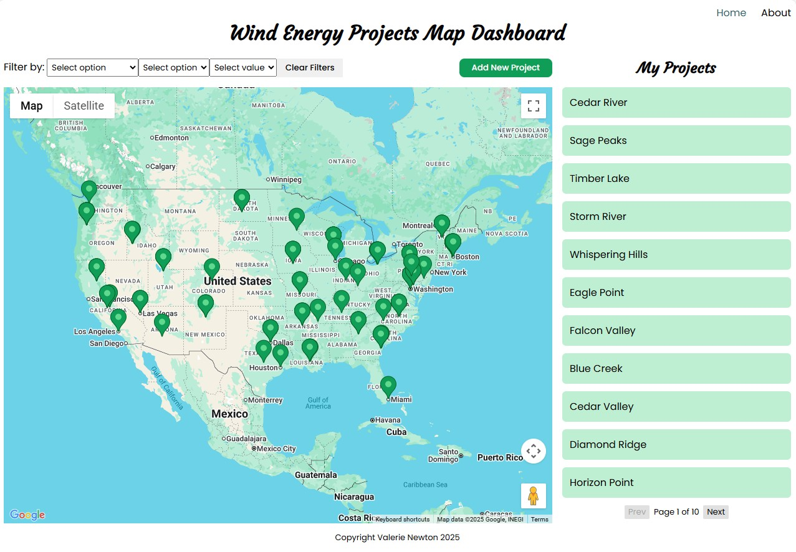
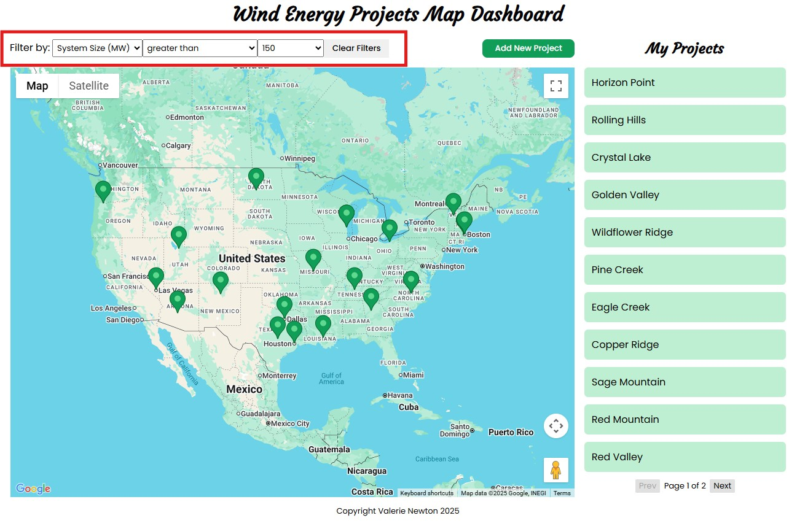
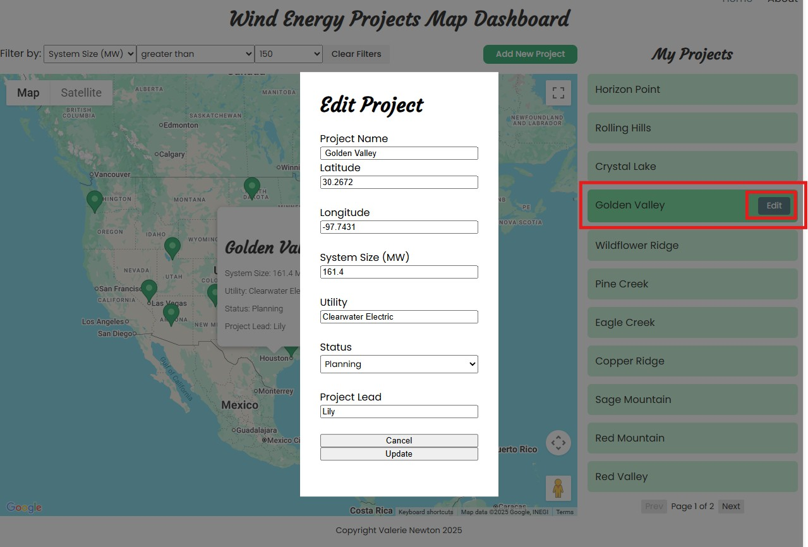
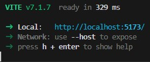

# Wind Energy Projects Map Dashboard

## Description

This project is written using React in [Vite](https://vite.dev/). It is a map dashboard app with Google Maps integration that allows a user to add and update items from a projects list. Each project has a latitude and longitude coordinate and gets displayed as a marker on the map. The markers are interactive with a pop-up info window when clicked on. A form with filter options allows the user to change which projects are displayed.

The project uses a fake dataset generated mainly with [Mockaroo](https://www.mockaroo.com/).

## Preview

Without filters applied:

With Filters Applied:

Click on a project under 'My Projects' to edit it:

## Technologies Used

- [React](https://react.dev/) single page application
- Routing done using [React Router](https://reactrouter.com/)
- [Airtable](https://airtable.com/) database used for data management
- Map built with [Google Maps JavaScript API](https://developers.google.com/maps/documentation/javascript/overview)
- [ESLint](https://eslint.org/) used for code analysis
- [Font Awesome](https://docs.fontawesome.com/web/use-with/react) used for icons

An API key is required for using Airtable. It is free to set up an Airtable account.
An API key is also required for using Google Maps. A Google Cloud account is required and is free to set up.

This project also incorporates [Google Fonts](https://fonts.google.com/) in for styling purposes.

## Setup

1. Clone the repository
   `https://github.com/vnewto/energy-projects-map-tool.git`
2. Install required packages and dependencies
   `npm install`
3. Run the front-end development server
   `npm run dev`
   Your terminal will show you a link:

Click on the localhost link to view the live server.

## Features

Users can:

- Filter their displayed projects and clear the filters when desired
- Add new projects
- Edit existing projects.
- Select a single project to view more information about it

## Potential Future Features

- Sort options for project list
- Free-text search option
- Option to delete a project
- Syncing of the project list pagination to the selected project

## Troubleshooting

If you are unable to clone the repository to your local machine, check your coding program for updates.
If the live server is not loading in the browser, check your internet connection.
Please [submit an issue](https://github.com/vnewto/energy-projects-map-tool/issues) if you have any other problems.

## Authors

Valerie Newton

## Acknowledgements

This project is part of my classwork in the Python class through [Code the Dream](https://codethedream.org/). Thank you to all the wonderful mentors and volunteers who put this program together and helped me through it. A special shout-out to [Rio Edwards](https://www.linkedin.com/in/rio-edwards/) for his mentoring and support.
